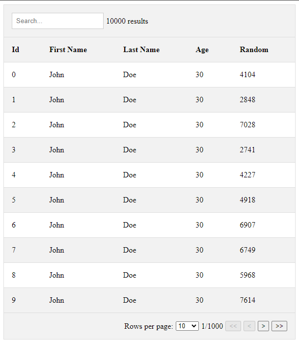

# just-table
A simple React table component that just works.  


| Parameter | Default Value | Comment |
| --- | --- | --- |
| data | [] | array of objects |
| columns | [] | array of objects |
| fullWidth | true | if true, table will take 100% width of parent container |
| autoGenerateColumns | true | if true, columns will be generated from data keys, if false, columns must be provided (camel case, underscore, dash) |
| pagination | true | if true, pagination will be enabled |
| paginationSize | 10 | number of rows per page (pagination have to be enabled) |
| search | true | if true, search will be enabled (search by all columns) |
| fuzzySearch | false | if true, fuzzy search will be enabled (allow typos and such) (search by all columns) |
| stickyHeader | true | if true, header will be sticky |
| stickyFooter | true | if true, footer will be sticky |

# example
```javascript
import Table from 'just-table';

const data = [
    {
        'id': 1,
        'name': 'John',
        'surname': 'Doe',
        'age': 25,
    },
    {
        'id': 2,
        'name': 'Jane',
        'surname': 'Doe',
        'age': 23,
    },
]

// columns can be generated from data keys (camel case, underscore, dash) if autoGenerateColumns is true or columns can be provided manually

// with autoGenerateColumns
const JustTable = () => <Table data={data} /> // yes it's that simple


// with columns
const columns = [
    'id',
    'name',
    'surname',
    'age',
]

const JustTable = () => <Table data={data} columns={columns} />
```




# TODO
- [x] pagination
- [x] search
- [x] style serach
- [x] rows per page
- [x] sticky header and footer
- [x] sort columns
- [x] fuzzy search
- [ ] select rows
- [ ] crud rows
- [ ] 
- [ ] change all buttons to icons if user sets icons=true
- [ ] virtualize
- [ ] filter columns
- [ ] handle nested data


